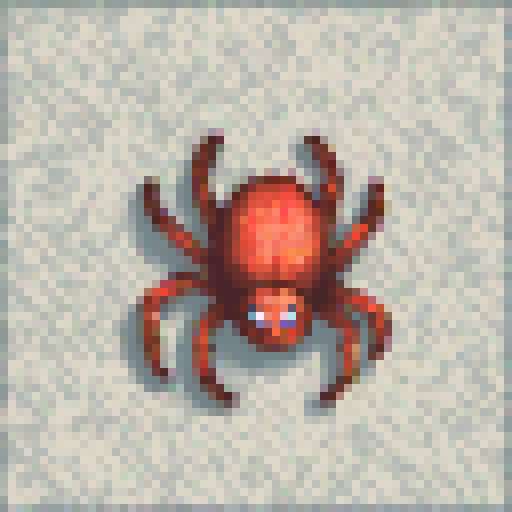
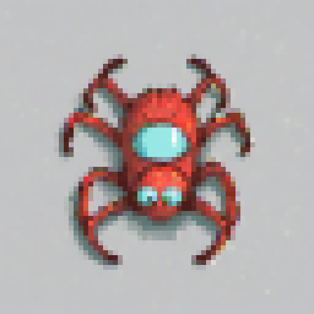

# pixelmon — pixel-art sprite generator on AMD ROCm

Generate game-ready pixel-art sprites from a text prompt with **one command**, on
an **AMD Radeon RX 6600** using ComfyUI + Stable Diffusion XL + the *Pixel Art XL*
LoRA. Built and battle-tested on Debian 13 with ROCm.

```bash
pixelmon "a fierce dragon"                     # full-quality sprite
pixelmon "a goblin" -n 8 --fast                # 8 quick variations
pixelmon "a knight" --palette PICO-8 --size 32 --transparent
```

<p>
  
  
  
  
</p>

*(`pixelmon "a knight in armor"`, then three variations of `pixelmon "a spider" -n …`.)*

---

## What this is

A thin, friendly CLI (`pixelmon`) over a local **ComfyUI** server, plus a custom
ComfyUI node (`pixelart_palette`) that turns the model's output into a true,
small, palette-locked sprite. You type a prompt; you get a PNG. The visual
node-graph is handled behind the scenes.

**The single most important lesson:** real pixel art needs a model *trained on
pixel art*. A general model (SD 1.5 / SDXL base) downscaled just looks like a
crushed photo. The **Pixel Art XL LoRA on SDXL** is what makes it genuinely
sprite-shaped — see [Lessons learned](#lessons-learned-the-gotchas).

---

## Hardware this was built for

| | |
|---|---|
| GPU | AMD Radeon RX 6600 (Navi 23, **gfx1032**, 8 GB) |
| OS | Debian 13 (Trixie), kernel 6.x |
| Stack | ROCm 6.2 · PyTorch 2.5.1+rocm6.2 · Python 3.10 · ComfyUI |
| RAM | 62 GB (lets SDXL run in `--lowvram` comfortably) |

It will likely work on other RDNA2/RDNA3 AMD cards; you may need a different
`HSA_OVERRIDE_GFX_VERSION` (see below) or none at all on officially-supported cards.

---

## Quickstart (already installed)

```bash
pixelmon "a cute slime monster"     # generate (auto-starts the server)
pixelmon --help                     # friendly, colorized help — all options
pixelmon --list-palettes            # available palettes
```

Output PNGs land in `~/ComfyUI/output/pixelmon/`:
- `*_sprite_*.png` — the **true-size** sprite (e.g. real 64×64) — your game asset
- `*_preview_*.png` — the same image **enlarged** so you can actually see it

The seed is in every filename, so to make a full-quality version of a fast draft
you liked, just re-run that seed:
```bash
pixelmon "a dragon" --fast            # prints e.g. seed=12345
pixelmon "a dragon" --seed 12345      # same dragon, full quality
```

---

## Install from scratch

```bash
git clone https://github.com/grymmjack/pixelmon.git ~/pixelmon
cd ~/pixelmon
./install.sh            # clones ComfyUI, builds the venv, links everything
./download-models.sh    # ~7.5 GB of models from Hugging Face (no login needed)
```

Then **log out and back in once** (so the `render` group sticks), and:
```bash
pixelmon "a fierce dragon"
```

`install.sh` is idempotent and explains each step. What it does:

1. Clones **ComfyUI** into `~/ComfyUI` (if absent).
2. Creates `~/ComfyUI/.venv` (Python 3.10) and installs
   `torch/torchvision/torchaudio==2.5.1+rocm6.2` from the ROCm index, then
   ComfyUI's `requirements.txt`.
3. **Symlinks** this repo's files into place (so the repo stays the source of truth):
   - `pixelmon.py` → `~/ComfyUI/pixelmon.py`
   - `custom_nodes/pixelart_palette` → `~/ComfyUI/custom_nodes/pixelart_palette`
   - `bin/pixelmon` → `~/.local/bin/pixelmon`
   - `launch-comfyui.sh` → `~/launch-comfyui.sh`
4. Adds you to the **`render`** group (`sudo usermod -aG render $USER`).

`download-models.sh` fetches into `~/ComfyUI/models/`:

| File | Size | Goes to |
|---|---|---|
| `sd_xl_base_1.0.safetensors` | 6.9 GB | `models/checkpoints/` |
| `pixel-art-xl.safetensors` (Pixel Art XL LoRA) | 171 MB | `models/loras/` |
| `lcm-lora-sdxl.safetensors` (for `--fast`) | 394 MB | `models/loras/` |

---

## Usage

Run `pixelmon --help` for the full, colorized list. The essentials:

| Flag | What it does | Default |
|---|---|---|
| `-n, --number N` | how many to make, each a different seed | `1` |
| `--size N` | sprite size in px: 16 / 32 / 64 / 128 (128 = sharpest) | `128` |
| `--palette NAME` | `none` (model's colors), PICO-8, Sweetie-16, NES, CGA-16, Game Boy DMG, Custom | `none` |
| `--transparent` | cut out the background → transparent PNG | off |
| `--dither` | Floyd-Steinberg dithering (faked shading) | off |
| `--fast` | LCM mode: ~5× faster (8 steps), slightly softer | off |
| `--seed N` | lock / repeat a result | random |
| `--steps`, `--cfg` | refinement steps / prompt adherence | 25 / 7 |
| `--lora-strength N` | how strongly to pixelate | 1.0 |
| `--custom-hex "…"` | colors for `--palette Custom` | — |

**Workflow tip:** explore with `--fast`, then re-run the `--seed` you liked
*without* `--fast` for the full-quality keeper.

---

## How it works

```
prompt ──► ComfyUI API
            CheckpointLoader (SDXL base)
              └─ LoraLoader (Pixel Art XL)  [─ LoraLoader (LCM) if --fast]
                   └─ KSampler ─► VAEDecode ─► PixelArtPalette ─► SaveImage
```

The custom **`PixelArtPalette`** node (`custom_nodes/pixelart_palette/`) is the
finishing pass that makes output a *true* sprite:

1. **smooth** (mode/median filter) — flattens soft gradients so backgrounds don't
   shatter into speckle when quantized.
2. **downscale**, grid-aware, to the target size — recovers the model's native
   ~128px pixel grid first (`nearest`), then integer-reduces to your size. This
   is what keeps edges **crisp** instead of soft; a single big reduction samples
   mid-block noise and looks fuzzy. (`--filter box` gives the old soft look.)
3. **palette** quantize — locks colors to a palette using *perceptual* (redmean)
   color distance; or `none` to keep the model's own colors.
4. **transparent** (optional) — border flood-fill removes the background, giving
   hard 1-bit alpha (no soft matte fringe — what sprites want).
5. **preview** — a nearest-neighbour upscaled copy so you can see the tiny sprite.

Palettes live in `custom_nodes/pixelart_palette/palettes.py` — add your own in the
`MY_PALETTES` dict (grab hex from [lospec.com](https://lospec.com/palette-list)).

---

## Lessons learned (the gotchas)

These cost real time; they're why the setup looks the way it does.

1. **`render` group, not just `video`.** ROCm talks to the GPU through `/dev/kfd`,
   which is owned by the `render` group. Without membership, `torch.cuda.device_count()`
   is `0` and `rocminfo` says *"not a member of render group"*. Fix:
   `sudo usermod -aG render $USER` then **log out/in**.
2. **`HSA_OVERRIDE_GFX_VERSION=10.3.0`.** The RX 6600 is **gfx1032**, which ROCm
   doesn't officially support — only gfx1030. This *runtime* env var makes it
   masquerade as gfx1030. (`PYTORCH_ROCM_ARCH` is build-time and does nothing here.)
3. **The model is everything.** SD 1.5 / SDXL-base downscaled = crushed photo, not
   pixel art. The **Pixel Art XL LoRA on SDXL** is what produces genuine sprites.
4. **SDXL can crash an 8 GB card.** A full-load run hung the `amdgpu` driver and
   green-screened the machine (a known RDNA2 + ROCm risk under sustained load).
   Fix/cushion: launch ComfyUI with **`--lowvram`** (streams the model from the
   62 GB of system RAM). Slightly slower, much safer. Remove it once you trust it.
5. **Enable persistent logs** so the *next* GPU hang is diagnosable:
   `sudo mkdir -p /var/log/journal && sudo systemctl restart systemd-journald`,
   then on a crash: `journalctl -k -b -1 | grep -i amdgpu`.

---

## Troubleshooting

| Symptom | Fix |
|---|---|
| `torch.cuda.is_available()` is False / 0 devices | not in `render` group, or missing `HSA_OVERRIDE_GFX_VERSION=10.3.0` |
| `rocminfo`: *"not a member of render group"* | `sudo usermod -aG render $USER`, log out/in |
| Output looks like a blurry photo, not pixels | you're not using the Pixel Art XL LoRA (`--no-lora` is on, or base model only) |
| Machine hangs / green-screens during generation | run with `--lowvram` (already default in `launch-comfyui.sh`); prefer `--fast` |
| First generation is slow | normal — it loads the 6.9 GB SDXL model; later runs reuse it |

---

## Repo layout

```
pixelmon/
├── README.md
├── install.sh                 reproducible setup (ComfyUI + venv + links + render group)
├── download-models.sh         fetch SDXL + Pixel Art XL + LCM from Hugging Face
├── pixelmon.py                the CLI brains (talks to ComfyUI's API)
├── bin/pixelmon               wrapper: ensures the server is up, then runs pixelmon.py
├── launch-comfyui.sh          ROCm-correct ComfyUI launcher (gfx override, render group, lowvram)
├── custom_nodes/
│   └── pixelart_palette/       the finishing node (smooth→downscale→palette→transparent)
│       ├── nodes.py
│       └── palettes.py         palette registry — add your own here
└── examples/                   sample sprites
```

---

## Credits & licenses

- [ComfyUI](https://github.com/comfyanonymous/ComfyUI) — the engine (GPL-3.0)
- [SDXL base 1.0](https://huggingface.co/stabilityai/stable-diffusion-xl-base-1.0) — Stability AI (CreativeML Open RAIL++-M)
- [Pixel Art XL](https://huggingface.co/nerijs/pixel-art-xl) — nerijs
- [LCM-LoRA SDXL](https://huggingface.co/latent-consistency/lcm-lora-sdxl) — Latent Consistency

The code in this repo (the CLI, wrapper, launcher, and custom node) is released
under the MIT License — see `LICENSE`.
