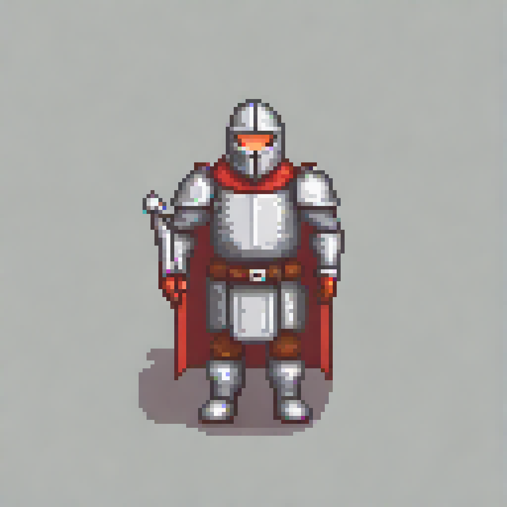
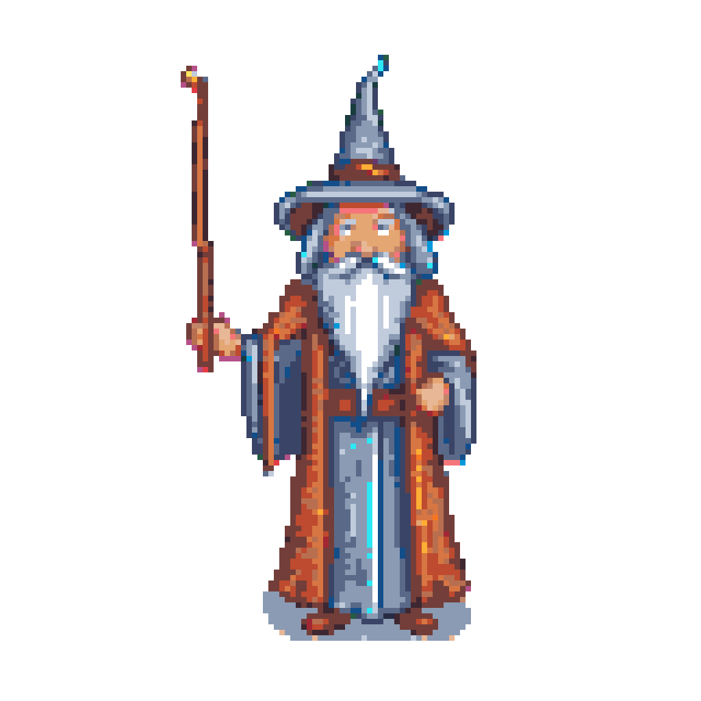
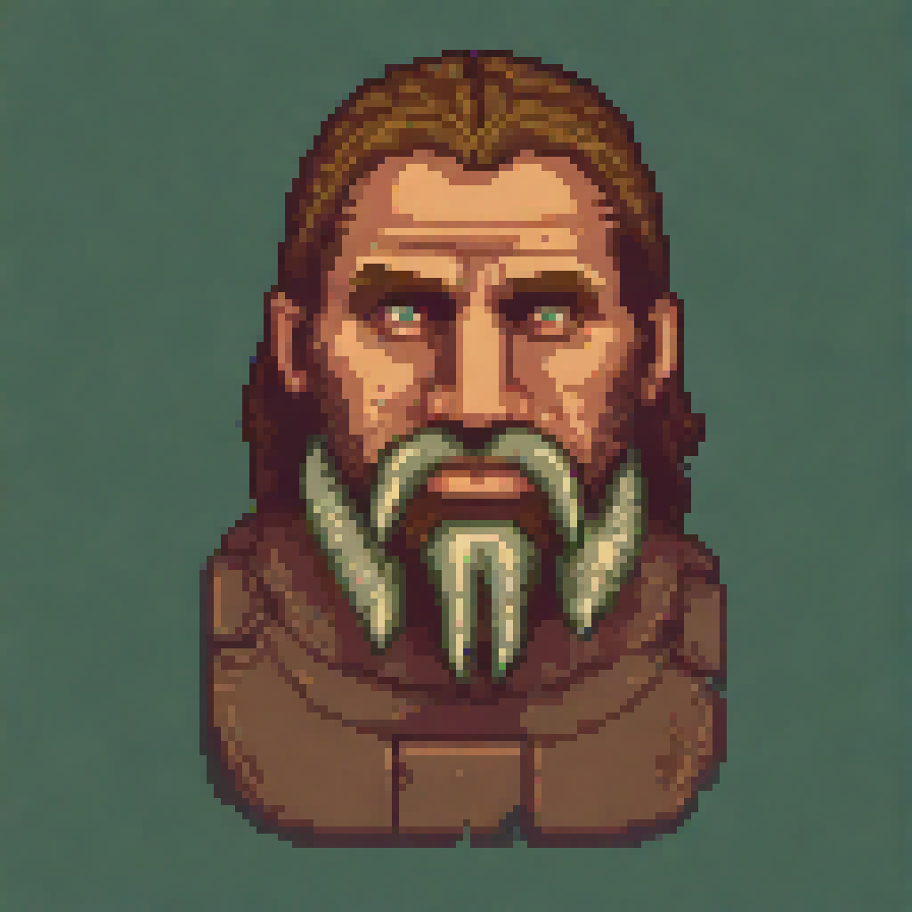
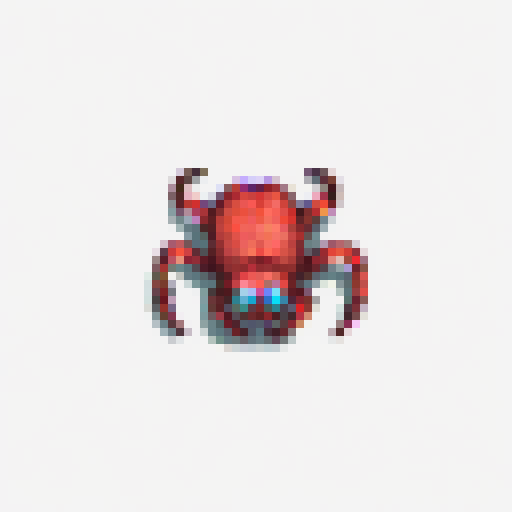

# pixelmon — pixel-art sprite generator (NVIDIA · AMD · CPU)

Generate game-ready pixel-art sprites from a text prompt with **one command**,
using ComfyUI + Stable Diffusion XL + the *Pixel Art XL* LoRA. Setup
**auto-detects your GPU** — NVIDIA (CUDA), AMD (ROCm), or CPU — and configures
itself. Built and battle-tested on an **AMD Radeon RX 6600** (Debian 13, ROCm);
see [GPU support](#gpu-support-nvidia--amd--cpu) for the NVIDIA path.

```bash
pixelmon "a fierce dragon"                     # full-quality sprite
pixelmon "a goblin" -n 8 --fast                # 8 quick variations
pixelmon "a knight" --palette PICO-8 --size 32 --transparent
```

<p>
  
  
  
  
</p>

*(`pixelmon "a knight in armor"` · `--palette ENDESGA-32` · `--style dosrpg` (Ultima/Wasteland portrait) · `"a spider"`)*

---

## What this is

A thin, friendly CLI (`pixelmon`) over a local **ComfyUI** server, plus a custom
ComfyUI node (`pixelart_palette`) that turns the model's output into a true,
small, palette-locked sprite. You type a prompt; you get a PNG. The visual
node-graph is handled behind the scenes.

**The single most important lesson:** real pixel art needs a model *trained on
pixel art*. A general model (SD 1.5 / SDXL base) downscaled just looks like a
crushed photo. The **Pixel Art XL LoRA on SDXL** is what makes it genuinely
sprite-shaped — see [Lessons learned](#lessons-learned-the-gotchas).

---

## GPU support (NVIDIA · AMD · CPU)

`install.sh` and `launch-comfyui.sh` **auto-detect the GPU vendor** and configure
the matching PyTorch wheel + launch flags — the same repo runs on any of these
with no flags. The CLI itself (`pixelmon.py`, `animate.py`) is vendor-agnostic: it
talks to ComfyUI over HTTP and runs CLIPSeg on CPU, so only those two setup
scripts are GPU-specific.

| Vendor | PyTorch | Launch config applied |
|---|---|---|
| **NVIDIA (CUDA)** | `cu124` wheel | none — ComfyUI auto-manages VRAM (12 GB+ runs SDXL fully loaded) |
| **AMD (ROCm)** | `2.5.1+rocm6.2` | `HSA_OVERRIDE_GFX_VERSION=10.3.0` · `render` group · `--lowvram` |
| **CPU** | cpu wheel | `--cpu` (works, but very slow) |

Detection: `nvidia-smi` present → NVIDIA; `/dev/kfd` present → AMD ROCm; else CPU.
Override with `PIXELMON_GPU=nvidia|amd|cpu`; pick an interpreter with `PYTHON=python3.11`.

### Tested / target machines

| | GPU | OS · stack | Notes |
|---|---|---|---|
| **Dev box** (battle-tested) | AMD Radeon RX 6600 (Navi 23, **gfx1032**, 8 GB) | Debian 13 · ROCm 6.2 · torch 2.5.1+rocm6.2 · Py 3.10 · 62 GB RAM | needs the gfx1032→gfx1030 override + `render` group + `--lowvram` |
| **NVIDIA box** (port target) | NVIDIA Titan Xp (**Pascal**, 12 GB) | Debian 12 · CUDA | no override / group / lowvram needed |

Other RDNA2/RDNA3 AMD cards likely work too (you may need a different
`HSA_OVERRIDE_GFX_VERSION`, or none on officially-supported cards).

### Performance note

Raw SDXL speed tracks the GPU's **fp16 throughput**, not its age or VRAM. Measured
on the two machines above — one 128px sprite (SDXL + Pixel-Art-XL, 25 steps, warm):

| GPU | per sprite |
|---|---|
| AMD RX 6600 (RDNA2, 8 GB) | ~49 s |
| NVIDIA Titan Xp (Pascal, 12 GB) | ~66 s |

The newer RDNA2 card is ~1.35× faster here — Pascal has weak native fp16. An older
big-VRAM card's edge is **headroom** (runs SDXL fully loaded, bigger batches/res)
and **stability** (CUDA, no ROCm driver hangs), not throughput. Benchmark your own:
`pixelmon "a dragon" --size 128` and read the `all done in …s` line (use a fresh
`--seed` each run — identical prompts hit ComfyUI's cache and report ~0s).

### Running on an NVIDIA box

Simplest model: run pixelmon **on** the NVIDIA machine (everything local — no
network or filesystem plumbing). With the NVIDIA driver installed so `nvidia-smi`
works:

```bash
sudo apt install -y python3.11-venv git          # if needed (Debian 12)
git clone https://github.com/grymmjack/pixelmon.git ~/pixelmon
cd ~/pixelmon && ./install.sh                     # auto-detects nvidia → CUDA wheel
./download-models.sh                              # all models incl. dosegafx
# confirm CUDA actually sees the card:
~/ComfyUI/.venv/bin/python -c "import torch; print(torch.cuda.is_available(), torch.cuda.get_device_name(0))"
~/launch-comfyui.sh                               # banner should read "NVIDIA CUDA (…)"
pixelmon "a fierce dragon"
```

> **Pascal caveat (Titan Xp = sm_61).** Current PyTorch still ships Pascal kernels.
> If the `torch.cuda` check above ever errors about an unsupported architecture,
> pin an older CUDA wheel — swap `cu124` → `cu121` on the torch line in `install.sh`.

**Keep it running headless.** A ComfyUI you start over SSH gets killed when the
session ends — unless you (a) enable lingering once so your processes survive
logout, and (b) run it under `tmux`:

```bash
loginctl enable-linger "$USER"
tmux new-session -d -s comfy '~/launch-comfyui.sh 2>&1 | tee ~/comfyui.log'
# watch it:   tmux attach -t comfy        (detach: Ctrl-b then d)
# or the GUI: http://<gpu-host-ip>:8188   (ComfyUI shows live generation progress)
```

### Render from another machine (`--server`)

Once ComfyUI is up on the GPU box, drive it from **any other machine** on the LAN —
pixelmon submits over HTTP and **fetches the results back to you** (no NFS/SSHFS):

```bash
pixelmon "a dragon" --server 192.168.1.50            # raw host (defaults to :8188)
pixelmon "a dragon" --server http://192.168.1.50:8188
pixelmon "a dragon" --server gpubox                  # a named alias (below)
```

Name your machines in **`servers.json`** (copy `servers.example.json`) so you can
use short aliases — it's gitignored, so your IPs stay out of the repo:

```json
{ "local": "http://127.0.0.1:8188", "gpubox": "http://192.168.1.50:8188" }
```

`$PIXELMON_SERVER` works too. The remote box just needs ComfyUI + models running;
the client only needs this repo (no GPU/torch). Results land in your local
`~/ComfyUI/output/pixelmon/` (or wherever `--output-to` points). The `--server`
flag also makes pixelmon **not** try to start a local server for a remote target.

### Render farm — fan jobs across multiple GPUs

Pass `--server` a **comma-list** and pixelmon turns into a render farm: it spreads
the work across every box and fetches all results back to you.

```bash
pixelmon --batch "bat,skeleton,spider" -n 30 --server rtx,titan,local
#   -> 90 sprites fanned across 3 GPUs; all land in your local output
```

It uses **dynamic dispatch** — each GPU is handed its next job the moment it goes
free, so faster cards automatically do more (no manual balancing) and nobody idles.
Unreachable boxes are skipped; if one drops mid-run its job is requeued to another.
Throughput scales ~linearly with the number of boxes. (Each ComfyUI still runs one
job at a time, so parallelism = number of boxes.)

> **Windows + NVIDIA?** See **[README-WINDOWS-NVIDIA.md](README-WINDOWS-NVIDIA.md)**
> for the WSL2 setup (GPU passthrough + the networking needed to join the farm).

---

## Quickstart (already installed)

```bash
pixelmon "a cute slime monster"     # generate (auto-starts the server)
pixelmon --help                     # friendly, colorized help — all options
pixelmon --list-palettes            # available palettes
```

Output PNGs land in `~/ComfyUI/output/pixelmon/`:
- `*_sprite_*.png` — the **true-size** sprite (e.g. real 128×128) — your game asset
- `*_preview_*.png` — an **enlarged** copy to eyeball easily — only with `--preview`

The seed is in every filename, so to make a full-quality version of a fast draft
you liked, just re-run that seed:
```bash
pixelmon "a dragon" --fast            # prints e.g. seed=12345
pixelmon "a dragon" --seed 12345      # same dragon, full quality
```

---

## Install from scratch

```bash
git clone https://github.com/grymmjack/pixelmon.git ~/pixelmon
cd ~/pixelmon
./install.sh            # clones ComfyUI, builds the venv, links everything
./download-models.sh    # ~7.6 GB of models from Hugging Face + Civitai (no login needed)
```

> **GPU auto-detection.** `install.sh` and `launch-comfyui.sh` detect your card —
> **NVIDIA (CUDA)**, **AMD (ROCm)**, or **CPU** — and configure the matching
> PyTorch wheel and launch flags automatically. The `render`-group + HSA-override
> + `--lowvram` steps are **AMD-only**; NVIDIA skips them. Force a vendor with
> `PIXELMON_GPU=nvidia|amd|cpu`, and pick an interpreter with `PYTHON=python3.11`.

On **AMD/ROCm**, log out and back in once (so the `render` group sticks). Then:
```bash
pixelmon "a fierce dragon"
```

`install.sh` is idempotent and explains each step. What it does:

1. Clones **ComfyUI** into `~/ComfyUI` (if absent).
2. Creates `~/ComfyUI/.venv` (Python 3.10) and installs
   `torch/torchvision/torchaudio==2.5.1+rocm6.2` from the ROCm index, then
   ComfyUI's `requirements.txt`.
3. **Symlinks** this repo's files into place (so the repo stays the source of truth):
   - `pixelmon.py` → `~/ComfyUI/pixelmon.py`
   - `custom_nodes/pixelart_palette` → `~/ComfyUI/custom_nodes/pixelart_palette`
   - `bin/pixelmon` → `~/.local/bin/pixelmon`
   - `launch-comfyui.sh` → `~/launch-comfyui.sh`
4. Adds you to the **`render`** group (`sudo usermod -aG render $USER`).

`download-models.sh` fetches into `~/ComfyUI/models/`:

| File | Size | Goes to |
|---|---|---|
| `sd_xl_base_1.0.safetensors` | 6.9 GB | `models/checkpoints/` |
| `pixel-art-xl.safetensors` (Pixel Art XL LoRA) | 171 MB | `models/loras/` |
| `lcm-lora-sdxl.safetensors` (for `--fast`) | 394 MB | `models/loras/` |
| `dosegafx.safetensors` (EGA retro style SDXL LoRA, [Civitai 290771](https://civitai.com/models/290771/ega-retro-style-sdxl)) | 82 MB | `models/loras/` |

---

## Usage

Run `pixelmon --help` for the full, colorized list. The essentials:

| Flag | What it does | Default |
|---|---|---|
| `-n, --number N` | how many to make, each a different seed | `1` |
| `--size N\|WxH` | square `N` (128 = sharpest), or non-square `WxH` e.g. `32x48` for tall character sprites | `128` |
| `--palette NAME` | `none` (model's colors), `random` (a different one per image), one of **55 bundled** (PICO-8, DAWNBRINGER-16, ENDESGA-32, NES, …, `--list-palettes`), or `Custom` | `none` |
| `--style NAMES` | append proven style guide(s), comma-separated (e.g. `geometric,detailed`) — `--list-styles` | — |
| `--batch "a,b,c"` | round-robin subjects, one of each per pass, each into its own folder (`-n` = how many of each) | — |
| `--snap-pixels` | snap to a perfect grid with the [pixel-snapper](https://github.com/Hugo-Dz/spritefusion-pixel-snapper) — extra crisp (auto-sizes) | off |
| `--transparent` | cut out the background → transparent PNG | off |
| `--preview` | also save an enlarged, zoomed-in PNG (else only the true-size sprite) | off |
| `--output-to DIR` / `--move-to-dirs` / `--create-dirs` | where finished files go — see [Batches](#batches--organizing-output) | — |
| `--dither` | Floyd-Steinberg dithering (faked shading) | off |
| `--fast` | LCM mode: ~5× faster (8 steps), slightly softer | off |
| `--server NAME\|host` | render on a remote ComfyUI (alias from `servers.json`, or `host[:port]`/URL); results fetched back over HTTP — see [Render from another machine](#render-from-another-machine---server) | local |
| `--seed N` | lock / repeat a result | random |
| `--steps`, `--cfg` | refinement steps / prompt adherence | 25 / 7 |
| `--lora-strength N` | how strongly to pixelate | 1.0 |
| `--custom-hex "…"` | colors for `--palette Custom` | — |

### Style guides (`--style`)

Style guides are proven prompt snippets appended to your prompt to steer the
look — they live in editable `styles.json` (`--list-styles` shows all). Combine
them: `--style geometric,detailed`. The `geometric` guide is built to fight
"too tame / rounded" output — it emphasizes `(sharp angular geometric:1.3)` and
pushes *rounded, smooth, organic, blobby* into the negative prompt:

```bash
pixelmon "a spider" --style geometric           # angular, spiky
pixelmon "a hero" --style 16bit,outline          # detailed + bold outline
pixelmon "a temple" --style blasphemous           # "in the style of" a game
```
Push harder with `--lora-strength 1.3` or a higher `--cfg`. Add your own guides
by editing `styles.json` (`{"name": {"prompt": "...", "negative": "..."}}`).

**Workflow tip:** explore with `--fast`, then re-run the `--seed` you liked
*without* `--fast` for the full-quality keeper.

### EGA / Wasteland portrait look

The vibrant 16-color **EGA / Wasteland** aesthetic — bold black outlines,
*purposeful* ordered dithering, saturated colors, like the 1988 game *Wasteland* —
comes from a dedicated LoRA, **EGA retro style SDXL**
([Civitai 290771](https://civitai.com/models/290771/ega-retro-style-sdxl), fetched
by `download-models.sh` as `dosegafx.safetensors`). Use it via `--lora` plus the
`dosega` style, which injects its `dosegagfx style` trigger word:

```bash
pixelmon "a grizzled raider" --lora dosegafx.safetensors --style dosega,portrait --palette EGA --size 128
```

Pair with `--palette EGA` to hard-lock the authentic 16 colors. Companion styles:
`ega` (palette/dither descriptors), `wasteland` (full Wasteland portrait look),
`portrait` (head-and-shoulders bust framing). Generate at **128–256px** so the
dithering reads — it averages out at tiny sizes.

### Animation (experimental)

`--animate` makes a **looping portrait-gesture GIF**, the way the original Wasteland
portraits animated: generate one base portrait, then re-paint *only* a small masked
region across a few frames while the rest stays frozen. It auto-masks the region
with text-prompted segmentation (CLIPSeg), so it understands `"the cigar"` /
`"the gun"` / `"the dog's mouth"` — not just human faces.

```bash
pixelmon "a mutant" --animate glow --anim-region "the eyes"          # eye-glow pulse
pixelmon "a mayor" --animate "smoke rising" --anim-box 0,0,0.5,0.62   # custom gesture + manual mask box
```

Knobs: `--anim-fps` (speed), `--anim-hold`, `--anim-frames`, `--anim-denoise`,
`--anim-loop`, and `--anim-region` / `--anim-box` (auto-mask vs. manual). Presets:
`blink`, `talk`, `glow`, `smoke`, `breathe`. Full list in `pixelmon --help`.

> ⚗ **Experimental.** At sprite scale the model can't author crisp 2-pixel motion —
> glow/light gestures read well, but subtle ones (blink, small mouths, rising smoke)
> often misread. For production sprites, render a **static** image and hand-animate
> it. Fully opt-in: nothing runs unless you pass `--animate`.

### Batches & organizing output

By default files stay in `~/ComfyUI/output/pixelmon/`. To organize a run into a
folder **relative to where you run the command**, use `--move-to-dirs` (one
folder per prompt) or `--output-to DIR` (a specific folder); add `--create-dirs`
to make missing folders.

**`--batch` is the overnight workhorse.** Give it several subjects and it
round-robins — one of each per pass — so every folder fills *evenly* instead of
finishing one subject before starting the next:

```bash
cd ~/sprites
pixelmon --batch "bat,skeleton,spider" -n 128 --fast
#  -> ./bat/ ./skeleton/ ./spider/, each filling up 1-at-a-time as it runs
```
Every other flag still applies (`--style`, `--palette random`, `--transparent`,
`--snap-pixels`, …). An interrupted run is still organized — files are moved out
of ComfyUI's output as each one finishes.

### Extra crispness (`--snap-pixels`)

`--snap-pixels` runs the render through [Hugo-Dz/spritefusion-pixel-snapper](https://github.com/Hugo-Dz/spritefusion-pixel-snapper)
(bundled, built by `install.sh` — needs the Rust toolchain). It auto-detects the
true pixel grid and snaps every pixel to it, removing the faint speckle/drift AI
output has. It auto-sizes (overrides `--size`); pair with `--palette` to then
lock the snapped result to specific colors.

---

## How it works

```
prompt ──► ComfyUI API
            CheckpointLoader (SDXL base)
              └─ LoraLoader (Pixel Art XL)  [─ LoraLoader (LCM) if --fast]
                   └─ KSampler ─► VAEDecode ─► PixelArtPalette ─► SaveImage
```

The custom **`PixelArtPalette`** node (`custom_nodes/pixelart_palette/`) is the
finishing pass that makes output a *true* sprite:

1. **smooth** (mode/median filter) — flattens soft gradients so backgrounds don't
   shatter into speckle when quantized.
2. **downscale**, grid-aware, to the target size — recovers the model's native
   ~128px pixel grid first (`nearest`), then integer-reduces to your size. This
   is what keeps edges **crisp** instead of soft; a single big reduction samples
   mid-block noise and looks fuzzy. (`--filter box` gives the old soft look.)
3. **palette** quantize — locks colors to a palette using *perceptual* (redmean)
   color distance; or `none` to keep the model's own colors.
4. **transparent** (optional) — border flood-fill removes the background, giving
   hard 1-bit alpha (no soft matte fringe — what sprites want).
5. **preview** (optional, `--preview`) — a nearest-neighbour upscaled copy so you
   can eyeball the tiny sprite without zooming.

Palettes **auto-load** from `custom_nodes/pixelart_palette/gpl/*.GPL` — 55 are
bundled (PICO-8, DAWNBRINGER, ENDESGA, NES, Game Boy, C=64, VGA, QUAKE, and more).
To add one, drop a GIMP `.GPL` file (export from GIMP/Aseprite, or grab one from
[lospec.com](https://lospec.com/palette-list)) into that folder and restart — the
filename minus its ` (N)` count becomes the palette name. You can also add hex
lists directly to the `MY_PALETTES` dict in `palettes.py`.

---

## Lessons learned (the gotchas)

These cost real time; they're why the setup looks the way it does. **Items 1, 2,
4, 5 are AMD/ROCm-specific** — `install.sh`/`launch-comfyui.sh` handle them
automatically on AMD and skip them on NVIDIA. Item 3 applies to every vendor.

1. **`render` group, not just `video`.** ROCm talks to the GPU through `/dev/kfd`,
   which is owned by the `render` group. Without membership, `torch.cuda.device_count()`
   is `0` and `rocminfo` says *"not a member of render group"*. Fix:
   `sudo usermod -aG render $USER` then **log out/in**.
2. **`HSA_OVERRIDE_GFX_VERSION=10.3.0`.** The RX 6600 is **gfx1032**, which ROCm
   doesn't officially support — only gfx1030. This *runtime* env var makes it
   masquerade as gfx1030. (`PYTORCH_ROCM_ARCH` is build-time and does nothing here.)
3. **The model is everything.** SD 1.5 / SDXL-base downscaled = crushed photo, not
   pixel art. The **Pixel Art XL LoRA on SDXL** is what produces genuine sprites.
4. **SDXL can crash an 8 GB card.** A full-load run hung the `amdgpu` driver and
   green-screened the machine (a known RDNA2 + ROCm risk under sustained load).
   Fix/cushion: launch ComfyUI with **`--lowvram`** (streams the model from the
   62 GB of system RAM). Slightly slower, much safer. Remove it once you trust it.
5. **Enable persistent logs** so the *next* GPU hang is diagnosable:
   `sudo mkdir -p /var/log/journal && sudo systemctl restart systemd-journald`,
   then on a crash: `journalctl -k -b -1 | grep -i amdgpu`.

---

## Troubleshooting

| Symptom | Fix |
|---|---|
| Wrong vendor detected | force it: `PIXELMON_GPU=nvidia\|amd\|cpu ./install.sh` (and same env for `launch-comfyui.sh`) |
| **(AMD)** `torch.cuda.is_available()` False / 0 devices | not in `render` group, or missing `HSA_OVERRIDE_GFX_VERSION=10.3.0` |
| **(AMD)** `rocminfo`: *"not a member of render group"* | `sudo usermod -aG render $USER`, log out/in |
| **(AMD)** machine hangs / green-screens during generation | run with `--lowvram` (auto on AMD in `launch-comfyui.sh`); prefer `--fast` |
| **(NVIDIA)** `torch.cuda.is_available()` False | NVIDIA driver not installed/loaded (`nvidia-smi` must work), or you got a CPU torch wheel — re-run `install.sh` |
| **(NVIDIA)** torch errors about unsupported arch (old card) | pin an older CUDA wheel: `cu124` → `cu121` on the torch line in `install.sh` |
| Output looks like a blurry photo, not pixels | you're not using the Pixel Art XL LoRA (`--no-lora` is on, or base model only) |
| First generation is slow | normal — it loads the 6.9 GB SDXL model; later runs reuse it |
| `Illegal instruction (core dumped)` when ComfyUI starts (older CPU) | a prebuilt wheel uses CPU instructions (e.g. AVX2) your CPU lacks. Find the culprit (`python -c "import kornia"` etc.) and remove it if optional — e.g. `pip uninstall -y kornia kornia_rs` (only used by ComfyUI post-processing nodes pixelmon doesn't need) |
| Server dies when you log out / close SSH | `loginctl enable-linger "$USER"` once, then run ComfyUI under `tmux` (see [Keep it running headless](#running-on-an-nvidia-box)) |
| `--server` job runs but no file appears locally | the result is fetched to `~/ComfyUI/output/pixelmon/` on the *client*; make sure that path is writable, or pass `--output-to DIR` |

---

## Repo layout

```
pixelmon/
├── README.md
├── README-WINDOWS-NVIDIA.md   Windows + NVIDIA (WSL2) setup guide
├── install.sh                 reproducible setup — auto-detects NVIDIA/AMD/CPU (venv + torch + links)
├── download-models.sh         fetch SDXL + Pixel Art XL + LCM + EGA-style LoRA (HF + Civitai)
├── pixelmon.py                the CLI brains (talks to ComfyUI's API)
├── animate.py                 experimental --animate engine (region inpaint + CLIPSeg auto-mask → GIF)
├── styles.json                --style guide snippets (edit / add your own)
├── servers.example.json       template for --server aliases (copy to servers.json, gitignored)
├── bin/pixelmon               wrapper: ensures the server is up, then runs pixelmon.py
├── launch-comfyui.sh          ComfyUI launcher — auto-detects vendor (AMD: gfx override + render group + lowvram)
├── custom_nodes/
│   └── pixelart_palette/       the finishing node (smooth→downscale→palette→transparent)
│       ├── nodes.py
│       └── palettes.py         palette registry — add your own here
└── examples/                   sample sprites
```

---

## Credits & licenses

- [ComfyUI](https://github.com/comfyanonymous/ComfyUI) — the engine (GPL-3.0)
- [SDXL base 1.0](https://huggingface.co/stabilityai/stable-diffusion-xl-base-1.0) — Stability AI (CreativeML Open RAIL++-M)
- [Pixel Art XL](https://huggingface.co/nerijs/pixel-art-xl) — nerijs
- [LCM-LoRA SDXL](https://huggingface.co/latent-consistency/lcm-lora-sdxl) — Latent Consistency
- [EGA retro style SDXL](https://civitai.com/models/290771/ega-retro-style-sdxl) — the EGA/Wasteland look (commercial use + derivatives OK, no credit required)
- [CLIPSeg](https://huggingface.co/CIDAS/clipseg-rd64-refined) — CIDAS, text-prompted segmentation for `--animate` auto-masking
- [spritefusion-pixel-snapper](https://github.com/Hugo-Dz/spritefusion-pixel-snapper) — Hugo Duprez (MIT), used by `--snap-pixels`

The code in this repo (the CLI, wrapper, launcher, and custom node) is released
under the MIT License — see `LICENSE`.
